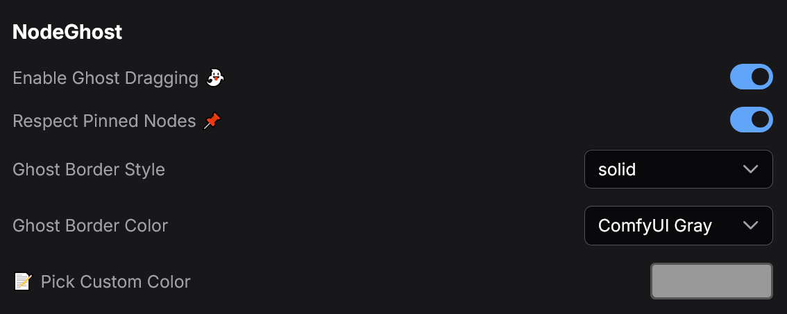

# ComfyUI-Drag-Ghost 👻

A premium visual enhancement for **ComfyUI** that adds a smooth "ghost" effect when dragging nodes and groups. This extension significantly improves the user experience by providing clear visual feedback, performance optimizations, and advanced handling for complex workflows.

## ✨ Features

### 🚀 **Visual & Performance**
*   **Smooth 60 FPS Rendering:** Uses `requestAnimationFrame` for buttery smooth dragging, even in massive workflows.
*   **Ghost Previews:** Shows a semi-transparent "ghost" of your selection (nodes and groups) while dragging.
*   **Grid Snapping:** Real-time visual snapping to the grid for precise alignment.

## 📦 Configuration



## 🎬 Example

<video src="files/dragghost.mp4" controls="controls" style="max-width: 100%;">
  Your browser does not support the video tag.
</video>

### 📦 **Advanced Group Support**
*   **Synchronized Movement:** Moving a generic group automatically moves all nodes inside it.
*   **Mixed Selection:** Seamlessly drag a combination of individual nodes and groups.
*   **Smart Ghosting:** Optimizes performance by rendering the group container instead of every individual node inside it.

### 📌 **Pinned Node Safety**
*   **Visual Feedback:** Pinned nodes appear in **RED** to indicate they are "stuck".
*   **Respect Pinned State:** Configurable setting to prevent pinned nodes from moving during a collective drag.
*   **Drag & Drop:** If "Respect Pinned" is disabled, pinned nodes will move but still show as red for awareness.

### 🎨 **Customization**
*   **Border Styles:** Choose from `Solid`, `Dashed`, `Dotted`, `Double`, or `None`.
*   **Custom Colors:** Pick any color for your ghost via the settings menu.
*   **Theme Integration:** Works out of the box with the default dark theme.

## ⚙️ Settings

You can configure the following options in the ComfyUI Settings menu (`Comfy.NodeGhost`):

*   **Enabled:** Toggle the extension on/off.
*   **Border Style:** Change the ghost border style.
*   **Border Color:** Select a custom color (HEX) for the ghost.
*   **Respect Pinned Nodes:** If enabled, pinned nodes will stay in place when dragging their group or selection.

## 📥 Installation

1.  Navigate to your ComfyUI `custom_nodes` directory:
    ```bash
    cd ComfyUI/custom_nodes/
    ```
2.  Clone this repository:
    ```bash
    git clone https://github.com/GalactusX31/ComfyUI-drag-ghost.git
    ```
3.  Restart ComfyUI.

## 🛠️ Logic & Behavior

*   **Cancel Drag:** Press `ESC` key to instantly cancel a drag operation and revert everything to its original position.
*   **Safety Checks:** Dragging is disabled when holding modifiers (`Ctrl`, `Shift`, `Alt`) to allow native ComfyUI functions (like cloning) to work without interference.
*   **UI Protection:** Prevents accidental dragging when interacting with sliders, text fields, or connection slots.

---

*Enhance your ComfyUI workflow with visual feedback.* 
